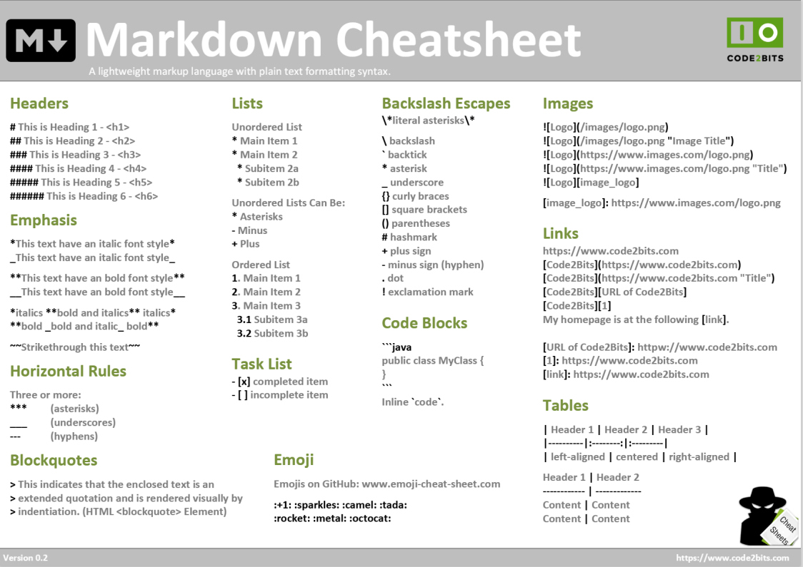

# DARRY Samuël

## Notre dossier de travail

Ceci sera notre dossier d'exercices personnels

<<<<<<< HEAD
=======
## Le Markdown

C'est una manière de faire de l'HTML simplifié, il est utilisé sur des sites comme githu.com (`README.md`), mais on le retrouve aussi dans des systèmes de commentaires voir de mailing. 

### Stylesheet 

### Stylesheet 

>>>>>>> 444d896351964bbf0b6d139fd69548c11038d918
